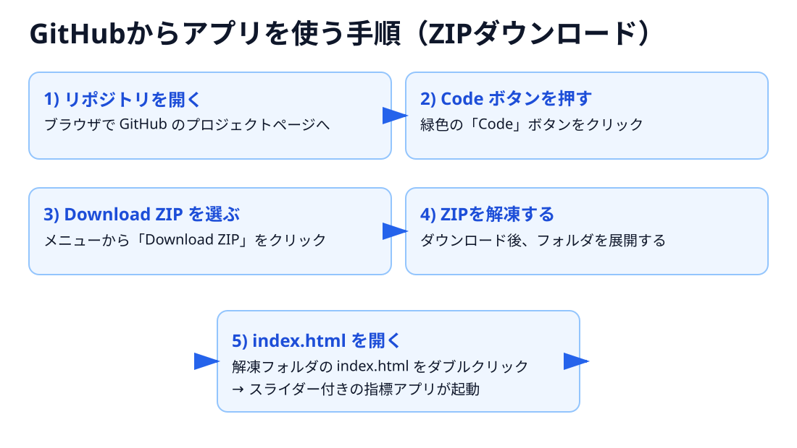

# 財務指標ビジュアライザー

ROE・EPS・PER・PBR・BPS の関係を、ブラウザ上でスライダー操作しながら学べるシンプルなWebアプリです。

## GitHubに不慣れな方向け（画像付き）

1. GitHub のリポジトリページを開く
2. `Code` ボタンを押す
3. `Download ZIP` を選ぶ
4. ダウンロードした ZIP を解凍
5. `index.html` をブラウザで開く

## 使い方

1. `index.html` をブラウザで開く。
2. 入力スライダー（純利益・自己資本・発行済株式数・株価）を動かす。
3. 指標カード、分子・分母の式表示、バー表示で変化を確認する。

## 指標の定義

- ROE = 当期純利益 ÷ 自己資本
- EPS = 当期純利益 ÷ 発行済株式数
- BPS = 自己資本 ÷ 発行済株式数
- PER = 株価 ÷ EPS
- PBR = 株価 ÷ BPS

加えて、`PBR ≒ PER × ROE（ROEは小数）` の関係も画面内で確認できます。
